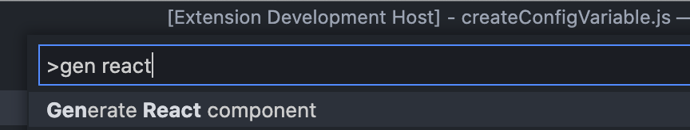
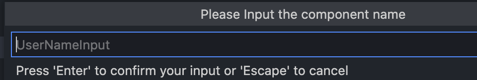
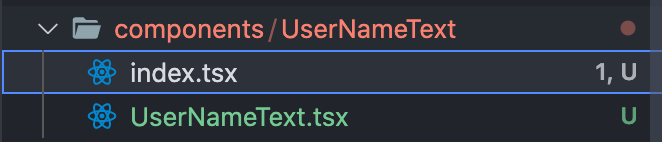

# Description

This is a **generator vscode extension** that makes react components.

## ⚽️ Example 

#### 1. Input the command

#### 2. Input the component name

#### 3. Created the component file

