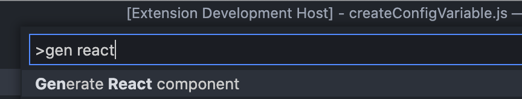
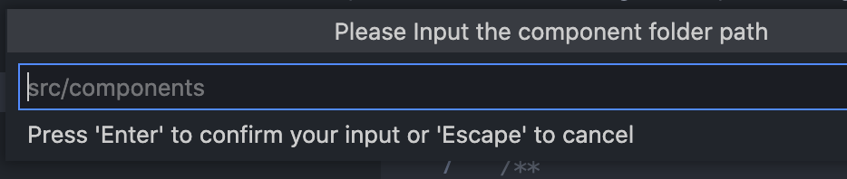
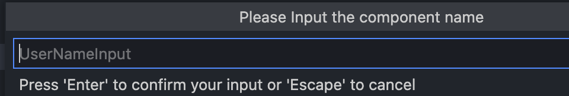
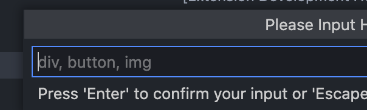

# Description

This is a **generator vscode extension** that makes react components.

## 😎 How do I install this extension?

You can install the latest version of the [Marketplace](https://marketplace.visualstudio.com/items?itemName=bugtype.generate-react-component)

The Component Preview [Storybook](https://marketplace.visualstudio.com/items?itemName=bugtype.generate-react-component)

## ⚽️ How do I use it?

#### 1. First, `CMD+SHIFT+P` and Enter `Generate React Component`
 
 

#### 2. Enter the component folder path (only one) 

#### 3. Enter the component name

#### 4. Enter the component you want to create.

#### 5. Created the component at folder

